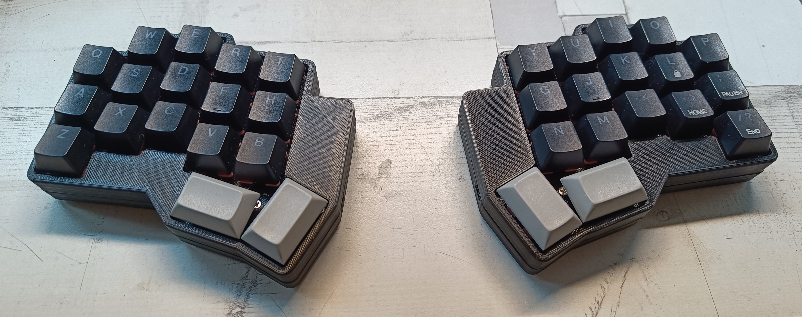
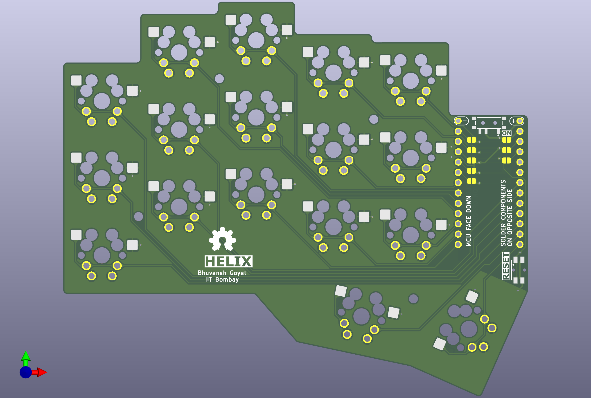
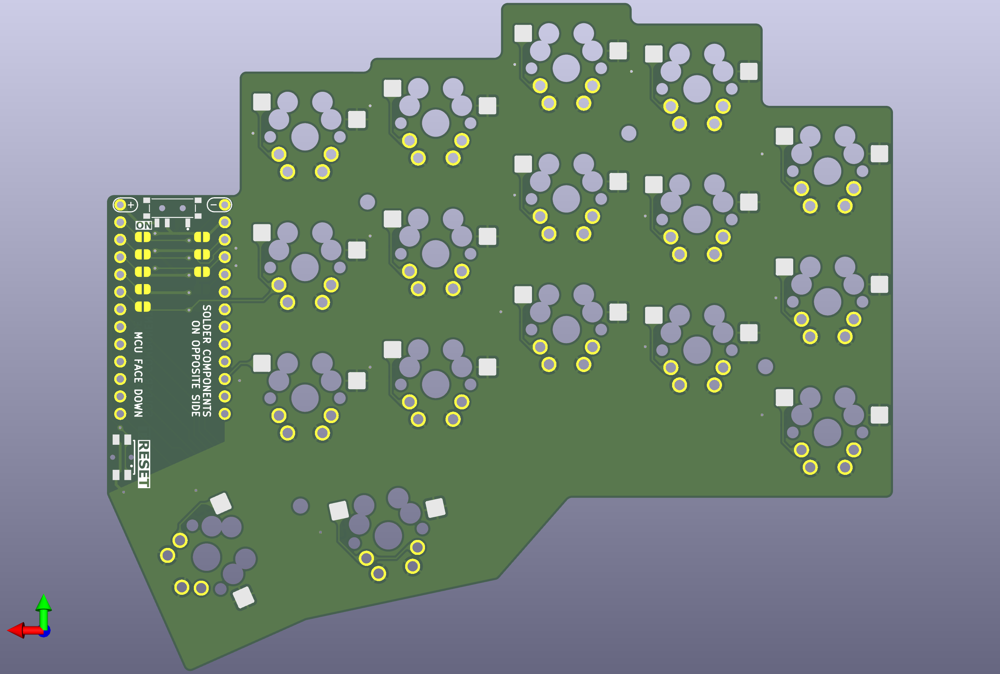

# Helix

My custom handcrafted 34-key split wireless keyboard.

## About This Build

I designed and built Helix as my daily driver keyboard. It's a 34-key split layout running ZMK firmware on nice!nano controllers. Each half is wireless and hot-swappable.

This has been genuinely gamechanging for me. There's definitely a learning curve - it took me a couple weeks to get back to my regular typing speed - but I can't imagine going back to a regular keyboard now. The difference in hand comfort after long coding sessions is night and day.

## Why 34 Keys Works

The magic is in the layers. Every key is maximum one key away from any finger, so there's almost no hand movement. I can configure it any way I want - putting symbols, numbers, navigation, everything exactly where I need it. No reaching for arrow keys or number row anymore.

At first, 34 keys seemed impossible. But with layers, I have more accessible keys than a regular keyboard, they're just not all visible at once. And since I configured every single key myself, the muscle memory built faster than I expected.

## What's Here

This repository has the PCB design files:

- **KiCad project files** - `helix.kicad_pcb`, `helix.kicad_sch`, `helix.kicad_pro`
- **Custom footprints** - Component footprints I made for this build
- **Custom symbols** - Schematic symbols
- **3D models** - STEP files

The firmware configuration is in my [zmk-helix](https://github.com/bgics/zmk-helix) repository.

## PCB Renders

Click to view

### Front

### Back

